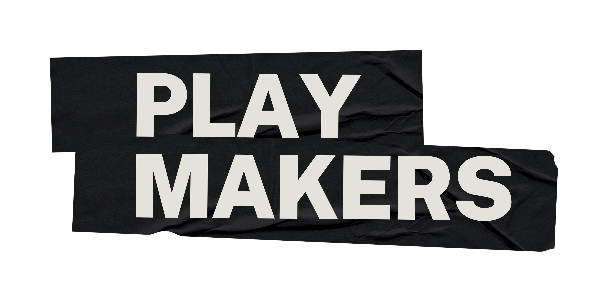
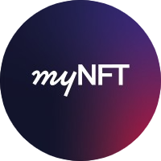
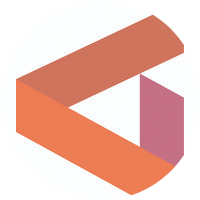
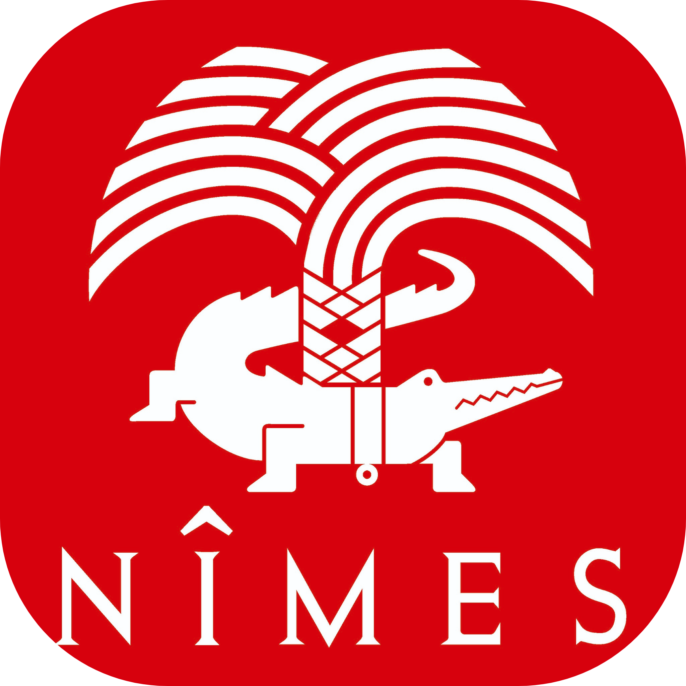

## PlayMakers 
- *Software engineer intern* | Apr'23 - Sep'23
- 
- Tags: Internship 
- Badges:
  - Badge [blue]
- List Items:
  - Blockchain
  - Backend
  - Devops
  - Test
  - Data analysis

## MyNFT
- *Software engineer intern* | June'22 - Sep'22
- 
- Tags: Internship
- Badges:
  - Badge [blue]
- List Items:
  - Blockchain
  - Backend
  - Devops
  - Internship report [/pdf/rdsmyNFT.pdf]

## Genvia
- *IoT engineer intern* | June'21 - Aug'21
- 
- Tags: Internship
- Badges:
  - Badge [blue]
- List Items:
  - Industry 4.0
  - MQTT SparkPlugB
  - MQTT
  - Ignition
  - Internship report [/pdf/rds1A.pdf]
  - Internship report link [/pdf/rds1Alink.pdf]

## KUAS
- *Exchange student* | Sep'22 - Apr'23
- 
- Tags: Scholar
- Badges:
  - Badge [blue]
- List Items:
  - Metaprogramming
  - C
  - Semi-conductor
  - Remote sensing

## ENSEEIHT
- *Student* | Sep'20 - Oct'23
- 
- Tags: Scholar
- Badges:
  - Badge [blue]
- List Items:
  - Software Engineering
  - All kind of programming
  - All kind of concept about programming

## Prepa Daudet Nimes
- *Student* | Sep'18 - Sep'20
- 
- Tags: Scholar
- Badges:
  - Badge [blue]
- List Items:
  - PCSI/PSI
  - Mathematics
  - Physics

